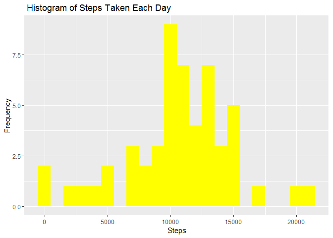
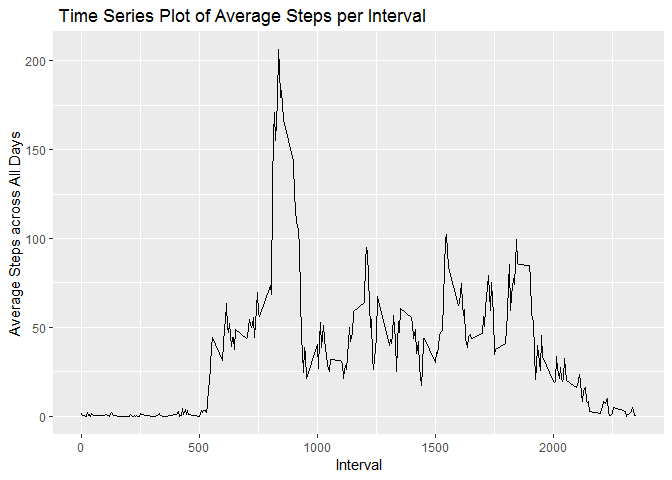
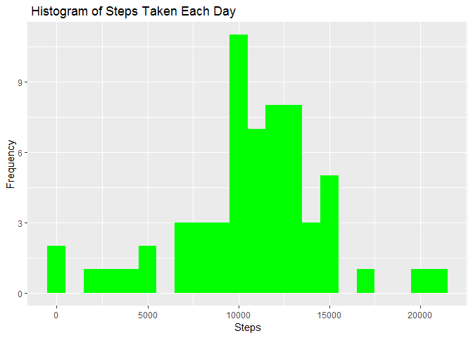
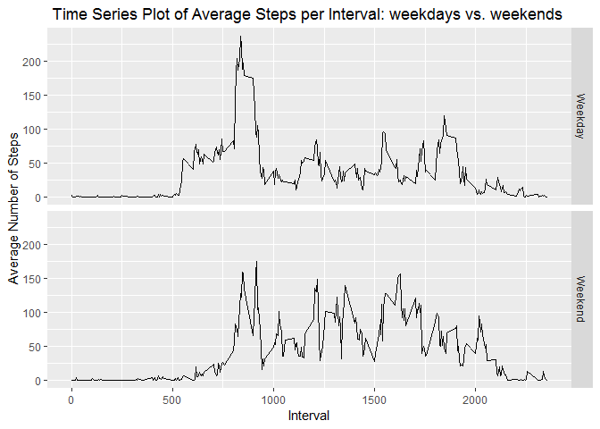

# Peer-graded Assignment: Course Project 1
It is now possible to collect a large amount of data about personal movement using activity monitoring devices such as a Fitbit, Nike Fuelband, or Jawbone Up. These type of devices are part of the "quantified self" movement - a group of enthusiasts who take measurements about themselves regularly to improve their health, to find patterns in their behavior, or because they are tech geeks. But these data remain under-utilized both because the raw data are hard to obtain and there is a lack of statistical methods and software for processing and interpreting the data.

This assignment makes use of data from a personal activity monitoring device. This device collects data at 5 minute intervals through out the day. The data consists of two months of data from an anonymous individual collected during the months of October and November, 2012 and include the number of steps taken in 5 minute intervals each day.

Data

The data for this assignment can be downloaded from the course web site: https://d396qusza40orc.cloudfront.net/repdata%2Fdata%2Factivity.zip

Dataset: Activity monitoring data [52K] 

The variables included in this dataset are:

.steps: Number of steps taking in a 5-minute interval (missing values are coded as NA)

.date: The date on which the measurement was taken in YYYY-MM-DD format

.interval: Identifier for the 5-minute interval in which measurement was taken

The dataset is stored in a comma-separated-value (CSV) file and there are a total of 17,568 observations in this dataset.

Assignment

This assignment will be described in multiple parts. You will need to write a report that answers the questions detailed below. Ultimately, you will need to complete the entire assignment in a single R markdown document that can be processed by knitr and be transformed into an HTML file.

Throughout your report make sure you always include the code that you used to generate the output you present. When writing code chunks in the R markdown document, always use echo = TRUE so that someone else will be able to read the code. This assignment will be evaluated via peer assessment so it is essential that your peer evaluators be able to review the code for your analysis.

For the plotting aspects of this assignment, feel free to use any plotting system in R (i.e., base, lattice, ggplot2)

Fork/clone the GitHub repository created for this assignment. You will submit this assignment by pushing your completed files into your forked repository on GitHub. The assignment submission will consist of the URL to your GitHub repository and the SHA-1 commit ID for your repository state.

NOTE: The GitHub repository also contains the dataset for the assignment so you do not have to download the data separately.

### Loading Library


```r
knitr::opts_chunk$set(echo = TRUE)
library(ggplot2)
```

```
## Warning: package 'ggplot2' was built under R version 3.4.4
```

### Loading and preprocessing the data

1. Load the data


```r
fullData <- read.csv("activity.csv")
```

2. Process/transform the data

```r
fullData$date <- as.Date(fullData$date, "%Y-%m-%d")
```

### A. What is mean total number if steps taken per day?
1) Calculate the total steps per day

```r
stepsPerDay <- aggregate(steps ~ date, fullData, FUN = sum)
```

2) Make a histogram of the total number of steps taken each day

```r
# Create the histogram
g <- ggplot (stepsPerDay, aes (x = steps))
g + geom_histogram(fill = "yellow", binwidth = 1000) +
    labs(title = " Histogram of Steps Taken Each Day ", x = "Steps", y = "Frequency")
```

<!-- -->

3) Calculate and report the mean and median of the total number of steps taken per day

```r
# Mean of steps
stepsMean <- mean(stepsPerDay$steps, na.rm=TRUE)
stepsMean
```

```
## [1] 10766.19
```

```r
# Median of steps
stepsMedian <- median(stepsPerDay$steps, na.rm=TRUE)
stepsMedian
```

```
## [1] 10765
```
The mean and median of the total number of steps taken per day are 1.0766189\times 10^{4} and 10765 respectively

### B. What is the average daily activity pattern?

1. Make a time series plot (i.e. type="l") of the 5-minute interval (x-axis) and the average number of steps taken, averaged across all days (y-axis)

```r
# create average number of steps per 5-min interval
stepsPerInterval <- aggregate(steps ~ interval, fullData, mean)

# Create a time series plot of average number of steps per interval, annotate the plot
h <- ggplot (stepsPerInterval, aes(x=interval, y=steps))
h + geom_line()+ labs(title = " Time Series Plot of Average Steps per Interval", x = "Interval", y = "Average Steps across All Days")
```

<!-- -->

2. Which 5-minute interval, on average across all the days in the dataset, contains the maximum number of steps?

```r
# Maximum steps by interval
maxInterval <- stepsPerInterval[which.max(stepsPerInterval$steps), ] 
maxInterval
```

```
##     interval    steps
## 104      835 206.1698
```

### C. Imputing missing value

1. Calculate and report the total number of missing values in the dataset (i.e. the total number of rows with NAs)

```r
# Number of NAs in the original dataset
noMissingValue <- nrow(fullData[is.na(fullData$steps),])
noMissingValue
```

```
## [1] 2304
```
2. Devise a strategy for filling in all of the missing values in the dataset. The strategy does not need to be sophisticated. For example, you could use the mean/median for that day, or the mean for that 5-minute interval, etc.

My strategy for filling in missing values (NAs) is to substitute the missing values (steps) with the average number of steps based on both the 5-minute interval and the day of the week  

```r
fullData1 <- read.csv("activity.csv", header=TRUE,sep=",")

# Create a variable/column with weekdays name
fullData1$day <- weekdays(as.Date(fullData1$date))

# create average number of steps per 5-min interval and day
stepsAvg1 <- aggregate(steps ~ interval + day, fullData1, mean)

# Create dataset with all NAs for substitution
nadata <- fullData1 [is.na(fullData1$steps),]

# Merge NAs dataset with the average steps based on 5-min interval+weekdays, for substitutions
newdata1 <- merge(nadata, stepsAvg1, by=c("interval", "day"))
```
3.  Create a new dataset that is equal to the original dataset but with the missing data filled in.

```r
# Pull data without NAs
cleanData <- fullData1 [!is.na(fullData1$steps),]

#Reorder the new substituted data in the same format as the clean data set (Leave out the NAs column which will be substituted by the average steps based on 5-min interval + day) 
newdata2 <- newdata1[,c(5,4,1,2)]
colnames(newdata2) <- c("steps", "date", "interval", "day")

# Merge the new average data (NAs) with the dataset without NAs
mergeData <- rbind (cleanData, newdata2)
```

4.  Make a histogram of the total number of steps taken each day and Calculate and report the mean and median total number of steps taken per day. Do these values differ from the estimates from the first part of the assignment? What is the impact of imputing missing data on the estimates of the total daily number of steps?

```r
# Calculate the total steps per day on the merged data
stepsPerDayFill <- aggregate(steps ~ date, mergeData, FUN = sum)

# Create the histogram
g1 <- ggplot (stepsPerDayFill, aes (x = steps))
g1 + geom_histogram(fill = "green", binwidth = 1000) +
    labs(title = " Histogram of Steps Taken Each Day ", x = "Steps", y = "Frequency")
```

<!-- -->

```r
# Mean of total steps with imputed data
stepsMeanFill <- mean(stepsPerDayFill$steps, na.rm=TRUE)
stepsMeanFill
```

```
## [1] 10821.21
```

```r
# Median of total steps with imputed data
stepsMedianFill <- median(stepsPerDayFill$steps, na.rm=TRUE)
stepsMedianFill
```

```
## [1] 11015
```

The new mean of the imputed data is 1.082121\times 10^{4} steps compared to the old mean of 1.0766189\times 10^{4} steps. That creates a difference of 55.0209226 steps on average per day.

The new median of the imputed data is 1.1015\times 10^{4}  steps compared to the old median of 10765  steps. That creates a difference of 250 steps for the median.

However, the overall shape of the distribution has not changed.

### D. Are there differences in activity patterns between weekdays and weekends?

1.  Create a new factor variable in the dataset with two levels - "weekday" and "weekend" indicating whether a given date is a weekday or weekend day.

```r
#create a new variable/column indicating weekday or weekend
mergeData$DayType <- ifelse(mergeData$day %in% c("Saturday", "Sunday"), "Weekend", "Weekday")
```

2.  Make a panel plot containing a time series plot (i.e. type="l") of the 5-minute interval (x-axis) and the average number of steps taken, averaged across all weekday days or weekend days (y-axis). See the README file in the GitHub repository to see an example of what this plot should look like using simulated data.

```r
# create table with average steps per time interval across weekday days or weekend days
stepsPerIntervalDT <- aggregate(steps ~ interval+DayType, mergeData, FUN = mean)
# Make the panel plot
j <- ggplot (stepsPerIntervalDT, aes(x=interval, y=steps))
j + geom_line()+ labs(title = " Time Series Plot of Average Steps per Interval: weekdays vs. weekends", x = "Interval", y = "Average Number of Steps") + facet_grid(DayType ~ .)
```

<!-- -->
